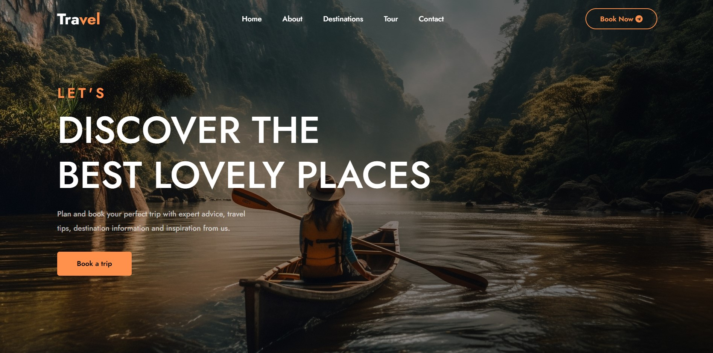

  <h1 align="center">Travel - Travel & Tour Website</h1>

  A landing page template for a travel website. It is fully responsive travel website,  Responsive for all devices, built using HTML, CSS, and JavaScript.

  <a href="https://keerti1924.github.io/Travel-Tour-Website/"><strong>➥ Live Demo</strong></a>

 

## 📃 Description

I created a landing page for a travel website by just using html and css. I tried to make a simple and user friendly interface.
 
 

 

Its a travel agency-like landing page design which includes home ,categories, about , popular destinations , activities , newsletter and footer sections and social media links of the travel website.

* A header section with the logo and navbar.
* A popular destinations type section.
* A newsletter section.
* A footer section.

## 🚀 Setup/Installation Requirements

To view the website, 
* click [Travel-Tour-Website](https://github.com/keerti1924/Travel-Tour-Website.git)
or 
* copy the link https://github.com/keerti1924/Travel-Tour-Website.git paste it to your browser and load it.  

## 🛠 Built With

* HTML
* CSS
* JAVASCRIPT

📱 Moreover, I've ensured that the website is fully responsive on all screens, making it accessible and user-friendly across various devices. 📱💡

## 🤝 Contributing 

Contributions, issues, and feature requests are welcome! Feel free to check the [issues page](/issues).

## ⭐️ Show your support 

Give a ⭐️ if you like this project!

## 📝 License

This project is **free to use** and does not contains any license.